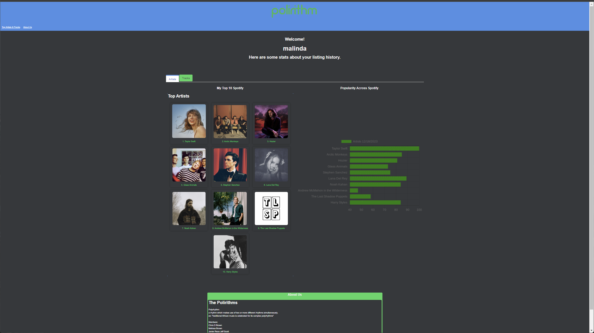

# polirithm
A music site using Spotify and graphing APIs.

### Polyrhythm
a rhythm which makes use of two or more different rhythms simultaneously.

Ex: "traditional African music is celebrated for its complex polyrhythms"

## Description

### User Story
AS A Spotify Listener, 
I WANT TO, Be able to view my listing statics and trends 
SO THAT I can gain more insight into my listening habits

### Concept

A small web app to view your top artists and tracks on spotify.

Create an easy way to check what you listen to most on spotify. Spotify releases its own “Spotify Wrapped” every year but we thought it would be cool if there was a way to view some of those stats year-round. 
User-Story

As a Spotify Listener I want to be able to view stats about my listening habits so that I can gain insight into my listening habits.

## Repo and Deployment 

GitPages deployed link:
https://Javreza.github.io/polirithm

GitHub Repo:
https://github.com/Javreza/polirithm

## Technologies

### Wireframe
Figma: https://www.figma.com/team_invite/redeem/pGwgGzOMpqZfXT2i0ubWUG

### APIs
Spotify: https://developer.spotify.com/documentation/web-api

Barcharts: 
https://www.chartjs.org/docs/latest/charts/bar.html
https://quickchart.io/documentation/#using-the-api - uses chartjs

### JavaScript
JavaScript
Jquery  

### CSS:
Bulma: https://bulma.io/

## Installation

N/A

## Usage

Does require a Spotity account to login to see Spotify and graphed data.
Does not require a paid account, free Spotify accounts can be used.
Page redirects for user to login to Spotify, then redirects back to Polirithm page.

## License

Please refer to the LICENSE in the repo.
MIT License
